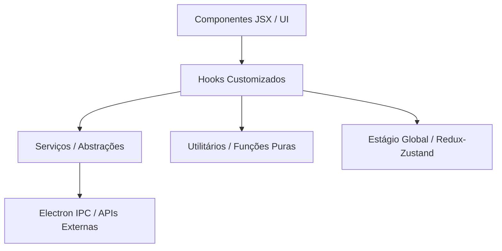

# Fluxo Lógico do Projeto (Refatorado)

Este documento descreve a nova arquitetura do projeto `Script-Node`, focada em separação de preocupações, escalabilidade e reutilização de código.

## 🏗️ Arquitetura em Camadas

A estrutura foi reorganizada para que os componentes de interface (UI) não contenham lógica de negócio complexa.

### 1. Camada de Hooks (`src/hooks/`)

Contém a "inteligência" dos componentes. Toda manipulação de estado local complexa, debouncing e integração com serviços deve morar aqui.

- `useRequestEditor`: Gerencia headers, params e corpo da requisição.
- `useGlobalContextMenu`: Analisa o DOM e decide quais itens de menu exibir.
- `useCodeSnippets`: Orquestra a geração de snippets e a visualização.

### 2. Camada de Serviços (`src/services/`)

Abstrai APIs externas e complexidades de infraestrutura.

- `electronService`: Centraliza todas as chamadas `window.electronAPI`, fornecendo fallbacks seguros e centralizando o tratamento de erros IPC.

### 3. Camada de Utilitários (`src/utils/`)

Funções puras que transformam dados sem efeitos colaterais.

- `dataTransformers`: Conversões entre JSON e List-View (Key/Value).
- `collectionUtils`: Manipulação da árvore de coleções.

### 4. Componentes de Visualização (`src/components/`)

Os componentes agora focam em:

- Estrutura HTML/JSX.
- Estilização (Tailwind/CSS).
- Mapeamento de propriedades do Hook para elementos da UI.

---

## ⚡ Exemplo de Fluxo: Edição de Requisição

1. **Usuário altera um Header**: O input chama `handleItemChange` fornecido pelo `useRequestEditor`.
2. **Hook Processa**: O hook atualiza a lista de itens e dispara `onInputChange` (que geralmente atualiza a Store global).
3. **Persistência Animada**: Se o usuário mudar para o modo JSON, o hook utiliza o `listToJson` do `utils/dataTransformers` para garantir que os dados sejam convertidos corretamente.

## 🛠️ Benefícios da Nova Organização

- **Testabilidade**: Hooks e Utilitários podem ser testados de forma isolada da UI.
- **Escalabilidade**: Novos recursos (como um novo modo de Auth) são adicionados no Hook, mantendo a UI limpa.
- **Reutilização**: A lógica de seleção de arquivos no Electron agora é uma única linha via `electronService`.
